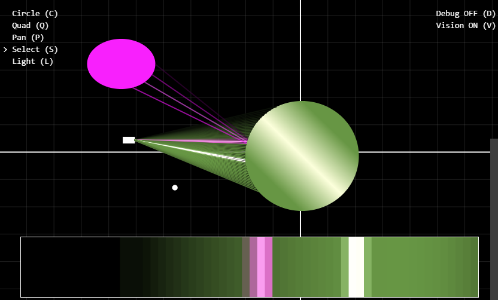

# Raymond

Play with Raymond at [raymond.maxledlie.com](raymond.maxledlie.com).

Raymond is a 2D [ray tracer](<https://en.wikipedia.org/wiki/Ray_tracing_(graphics)>) that produces a 1D image.
Drag the camera, objects and lights around and see the light rays that reach the camera and the resulting image. Featuring lights, shadows, reflections and refractions.

To run Raymond locally, clone this site and run `npm install && npm run dev`.

Raymond uses React for rendering UI and the HTML canvas for rendering the world.
The lighting model is adapted from the one described in [The Ray Tracer Challenge](https://www.amazon.co.uk/Ray-Tracer-Challenge-Jamis-Buck/dp/1680502719), which I would highly recommend if you'd like to learn more about ray tracing.
